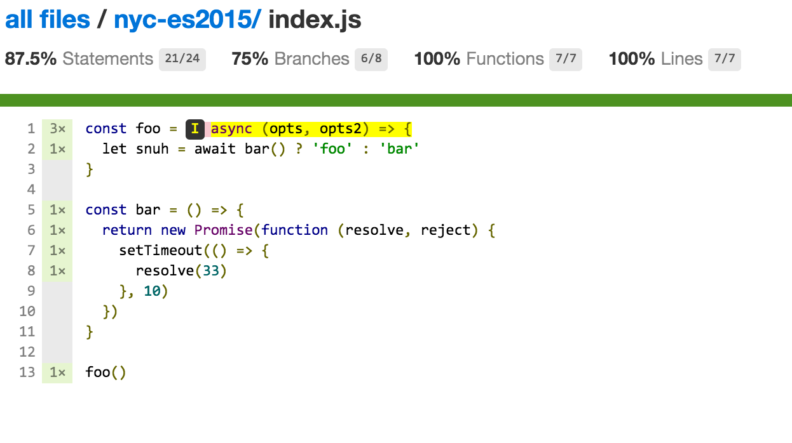
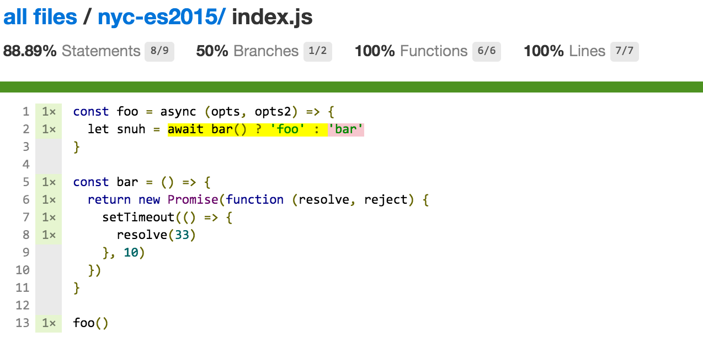

There are two branches. The `master` branch uses basic `nyc`, the `coverage` branch uses [`__coverage__`](https://github.com/dtinth/babel-plugin-__coverage__) instead of `nyc`'s bundled `istanbul`.

# Html report for `master`

# Html report for `coverage` branch

